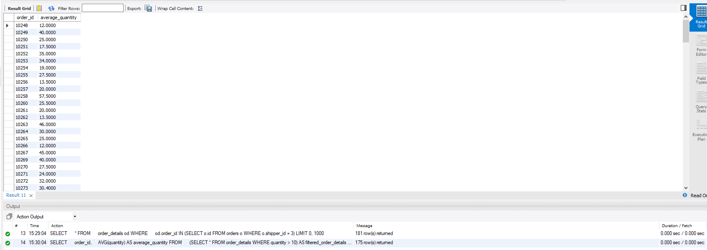

# Домашнє завдання до Теми 5. Вкладені запити. Повторне використання коду


## 1. SQL запит, який відображає таблицю order_details та поле customer_id з таблиці `orders` відповідно для кожного поля запису з таблиці `order_details`.
Зроблено за допомогою вкладеного запиту в операторі `WHERE`.

```sql
SELECT 
    od.*,
    (SELECT o.customer_id FROM orders o WHERE o.id = od.order_id) AS customer_id
FROM 
    order_details od;
```


## 2. SQL запит, який відображає таблицю `order_details`, відфільтровуючи результати, щоб відповідний запис із таблиці `orders` виконував умову `shipper_id=3`.

Зроблено за допомогою вкладеного запиту в операторі `WHERE`.

```sql
SELECT 
    *
FROM 
    order_details od
WHERE 
    od.order_id IN (SELECT o.id FROM orders o WHERE o.shipper_id = 3);
```


## 3. SQL запит, вкладений в операторі `FROM`, який обирає рядки з умовою `quantity > 10` з таблиці `order_details`.

Для отриманих даних знайдено середнє значення поля `quantity`, групування за `order_id`.

```sql
SELECT 
    order_id,
    AVG(quantity) AS average_quantity
FROM 
    (SELECT * FROM order_details WHERE quantity > 10) AS filtered_order_details
GROUP BY 
    order_id;
```

	
## 4. Запит, який використовує оператор `WITH` для створення тимчасової таблиці `temp`, з умовою `quantity > 10` з таблиці `order_details`.

```sql
WITH temp AS (
    SELECT * FROM order_details WHERE quantity > 10
)
SELECT 
    order_id,
    AVG(quantity) AS average_quantity
FROM 
    temp
GROUP BY 
    order_id;
```


## 5. Функція з двома параметрами, яка ділить перший параметр на другий.

Обидва параметри та значення, що повертаються, мають тип `FLOAT`. Використовується конструкція `DROP FUNCTION IF EXISTS`. Функція застосована до атрибута `quantity` таблиці `order_details`. Другий параметр — довільне число.


```sql
DELIMITER //

-- Створення функції
DROP FUNCTION IF EXISTS divide_numbers //
CREATE FUNCTION divide_numbers(numerator FLOAT, denominator FLOAT) RETURNS FLOAT
BEGIN
    DECLARE result FLOAT;
    
    IF denominator = 0 THEN
        SET result = NULL;
    ELSE
        SET result = numerator / denominator;
    END IF;

    RETURN result;
END //

DELIMITER ;

-- Використання функції
SELECT 
    quantity,
    divide_numbers(quantity, 2.0) AS divided_value
FROM 
    order_details;
```
